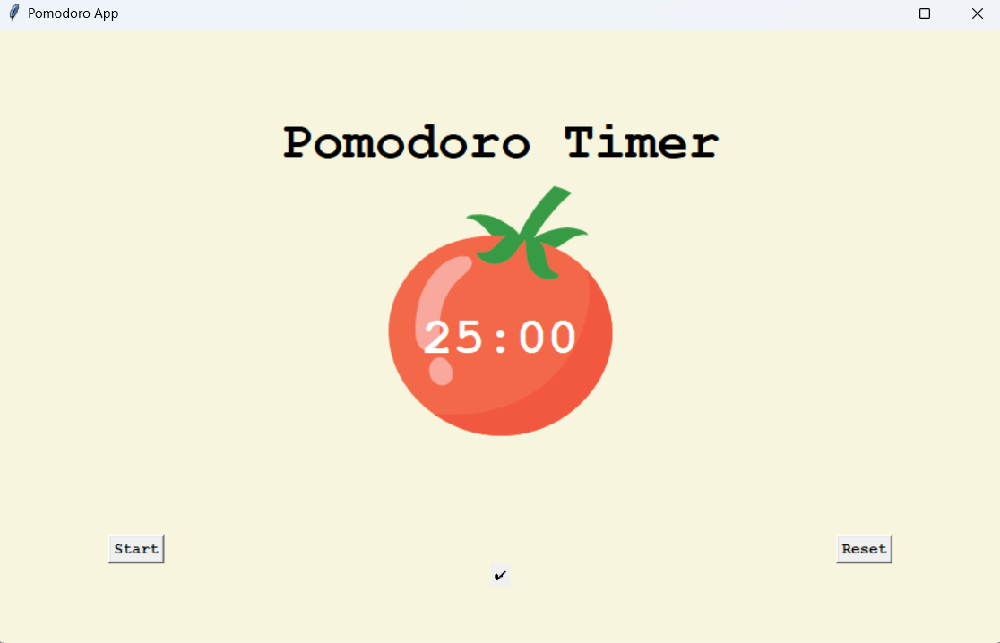

# Pomodoro Technique

#### The Pomodoro Technique is a time management method developed by Francesco Cirillo in the late 1980s. It uses a kitchen timer to break work into intervals, typically 25 minutes in length, separated by short breaks.

#### This method which has provoked the inner productivity in me, has even motivated me to create this timer just for the sake for implementing this technique, in my own way.

</img>

<h3> You are free to read the code and suggest necessary pull requests to make the game more efficient</h3>